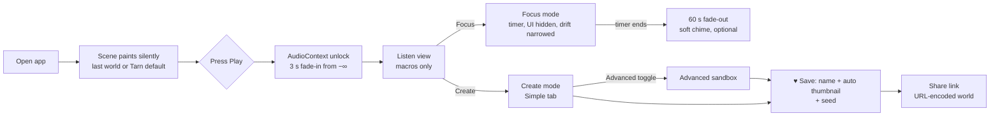
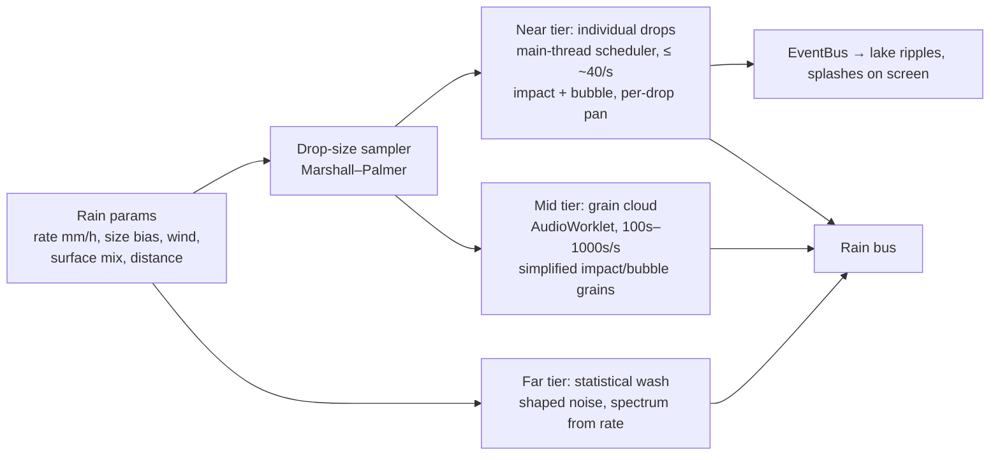
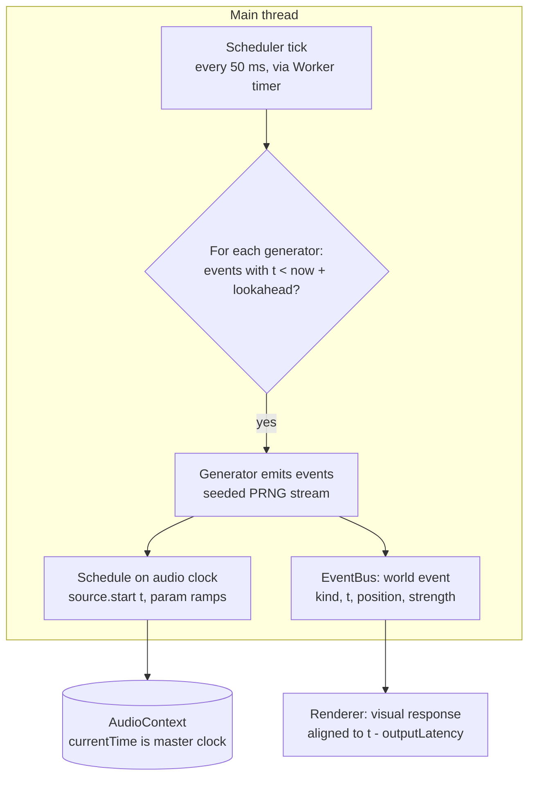
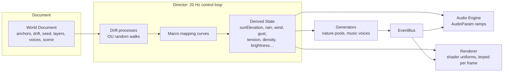
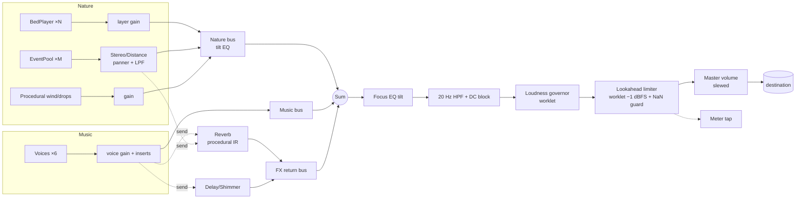
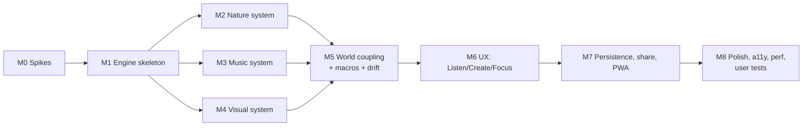

# Ambience Sandbox: Product & Development Plan

> Status: planning. No code yet. This document is meant to be detailed enough that the next working session can start **Milestone 0/1** directly.
>
> Convention used throughout:
> - **Evidence** means a claim backed by a cited source. Sources are numbered and listed at the end.
> - **Recommendation** means my design or engineering judgement. It can be wrong. Where I'm unsure, I say so and add a spike to test it.

---

## 0. TL;DR

- **What it is:** a web app (installable PWA) that renders one coherent *world*: nature sound, generative music and procedural visuals all driven by one shared **World State**. Press play and it's good immediately. Open Create mode and every layer is yours to break.
- **What's distinctive:** the world *causes* both the sound and the image. A heron lands, so you hear the splash and see the ripple. Lightning flashes, then thunder follows with a delay set by its distance. Visuals don't *react to* an FFT the way a music visualizer does. This event-driven coupling is the product's signature.
- **MVP (desktop-first, non-commercial, free assets — see §11):** one exceptionally polished world, **"Tarn"** (an alpine lake with weather and a day/night cycle), four cross-domain macros (Time, Weather, Energy, Strangeness), Create mode with Simple and Advanced layers, Focus mode, a timer, local saves, seeds, and a share link. No accounts, no AI, no audio export.
- **Stack:** TypeScript + Vite, raw Web Audio API with AudioWorklets for safety DSP, our own lookahead scheduler, WebGL2 for visuals (WebGPU later), Svelte 5 for UI, IndexedDB for persistence, a service worker for offline use.
- **Hardest risks:** (1) nature beds that sound loopy or fake, (2) music that becomes annoying after 90 minutes, (3) procedural visuals that look like a 2009 screensaver, (4) long-session robustness on desktop (sleep/wake, device changes). All four get throwaway spikes in Milestone 0, before any real architecture is built.

---

## 1. Research summary

### 1.1 Existing products: what they do and where the gap is

| Product | What it does well | What it lacks, relative to this brief |
|---|---|---|
| **myNoise** | 10-band generators spanning 20 Hz–20 kHz, a hearing-calibration flow, and a speech-masking ("green") noise preset [1][2] | Very utilitarian. No visuals, no evolving music, and each slider is a static layer |
| **A Soft Murmur** | Per-sound volume mixing, a timer, save/share, and a "Meander" feature that slowly drifts each layer's volume [3] | Loops of flat recordings; no scene, no music |
| **Noisli** | Mixing, saved combos, a productivity timer, on web, a browser extension and mobile [3][4] | Same as above |
| **Rainy Mood** | Depth in one domain: 400+ unique thunderclaps and many individual rain-surface recordings [3] | Single-purpose |
| **Endel** | Real-time generative soundscapes adapted to time, weather, heart rate and location, organised into modes (Focus/Relax/Sleep…) [5][6] | Almost no user control. You consume it; you can't make anything |
| **Portal** | Cinema-grade nature video plus head-tracked spatial audio, split into Focus/Sleep/Escape [7][8] | Captured media rather than generated, so it isn't a sandbox and doesn't evolve |
| **Bloom (Eno/Chilvers)** | Generative music via touch; the canonical "interactive ambient" app [9] | Music only |
| **Generative.fm** | Open-source, browser-based endless generative music from many generators [10][11] | Music only, and not user-composable |

**Recommendation.** The gap isn't another mixer or another generative stream. It's **a composable world** where nature, music and image share one state, with depth for tinkerers and a one-tap default for everyone else. Nobody in the table does "Endel's continuity + myNoise's control + Portal's sense of place + Bloom's playfulness".

Steal these specifically:
- **Meander** from A Soft Murmur. This becomes the "drift" system (§4.3).
- **Surface-specific rain one-shots** from Rainy Mood. Rain *on something* sounds real; rain alone sounds like static.
- **Calibration** from myNoise. Later, not MVP.
- **Mode framing** from Endel/Portal. Users already understand "Focus / Relax / Create".

### 1.2 Evidence on background sound while studying

This matters for honest product copy and for sensible defaults.

**Evidence:**
- A Bayesian meta-analysis of 65 studies found that background **noise, speech and music all have a small but reliable *negative* effect on reading** performance [12].
- **Lyrics** specifically hurt verbal memory, visual memory and reading comprehension (effect ≈ −0.3), while instrumental lo-fi showed **no credible benefit or harm** [13].
- A 2023 meta-analysis (47 studies, 71 effect sizes) reported a **small positive average effect** of background music on learning outcomes, but with **heavy heterogeneity**. Preference, familiarity, the learner and the task all moderate the result [14][15].
- **Personality:** introverts' reading comprehension suffers more than extraverts' under music and noise, and the two groups perform equally in silence [16][17].
- **White/pink noise and ADHD:** across 13 randomised studies, noise gave a small benefit to youth with ADHD or elevated attention problems (g ≈ 0.25) and a small **harm** to non-ADHD groups (g ≈ −0.21) [18].
- **The "Mozart effect"** has little support in meta-analysis. Where boosts appear, they are better explained by arousal and mood (enjoyment), not by the music's structure [19][20].
- **Natural sounds** show some evidence of supporting attention restoration and mood. For example, forest soundscapes improved mood, restoration and cognition compared with industrial soundscapes, but not physiological stress [21][22][23]. Effects are generally modest and depend on context.

**What this means for the design (Recommendations):**
1. **Never claim the app improves focus.** Honest copy: *"Some people focus better with background sound; many do better in silence, especially for reading. Use what works for you."* Consider an in-app link to a short "what the research says" page.
2. **Default Focus presets lean nature-first and low-density**: no foreground melody, no lyrics ever, and slow change.
3. **"Near-silence" is a first-class preset**, not an afterthought.
4. **Keep "evolving" and "distracting" separate.** In Focus mode, drift narrows and surprise events get rarer (§2.5).
5. **Arousal and mood are a legitimate reason to use the app.** Enjoyment is a real benefit, so make building a world genuinely delightful.

### 1.3 Technical findings

| Topic | Evidence | Implication |
|---|---|---|
| Autoplay | An AudioContext created outside a user gesture starts `suspended` and must be `resume()`d from a gesture [24][25] | The first "Play" is always a click or tap. We design the home screen around that: the Play button *is* the unlock |
| Scheduling | JS timers are imprecise; the standard pattern is a timer that schedules Web Audio events a short window ahead on the audio clock ("A Tale of Two Clocks") [26][27] | Build our own lookahead scheduler on `AudioContext.currentTime` |
| Background tabs | Chrome's intensive throttling (1 wake per minute) applies to pages hidden 5+ minutes *that have been silent for 30 s*; pages making sound are exempt [28] | Desktop background playback is fine. Use a generous lookahead anyway (§3.6) |
| iOS silent switch | Web Audio uses the ambient session, which the ring/silent switch mutes; setting `navigator.audioSession.type = 'playback'` before creating the context is reported to fix this (Safari 16.4+) [29][30] | Set it on iOS. **Developer reports, not Apple docs, so verify in M0** |
| iOS lock screen | Developers report Web Audio suspends when the screen locks unless the page holds a playback audio session; a WebKit fix reportedly landed around iOS 17.5 [31][32] | **Unknown until tested on real devices.** This is in the M0 spike |
| Limiting | `DynamicsCompressorNode` offers no lookahead; a true brick-wall limiter needs an AudioWorklet [33] | Write a small lookahead limiter worklet (§4.4) |
| GPU | WebGPU ships in Chrome/Edge (2023), Safari 26 (2025) and Firefox 141 on Windows, with Linux still pending [34][35] | WebGL2 for the MVP (universal); WebGPU is a later optimisation, not a dependency |
| Storage | Safari's ITP deletes script-writable storage after 7 days without interaction, **but home-screen web apps are exempt** [36] | Saved worlds are also shareable as URLs, so nothing precious lives only in IndexedDB. Nudge iOS users to "Add to Home Screen" |
| Procedural nature audio | Farnell's *Designing Sound* builds wind, rain and thunder procedurally; the approach ran in real time on very modest hardware [37][38] | Procedural wind and rain-texture layers are feasible and parametric |
| Real-time AI music | Lyria RealTime streams steerable music over WebSocket (paid API) [39]; Magenta RealTime is open-weights (Apache-2.0 code, CC-BY-4.0 weights) at 800M params, with a 2.4B v2 [40][41] | Viable later as an *optional experimental layer*; wrong for the MVP (§3.1) |
| Safe listening | WHO/ITU H.870 sets a reference of 80 dBA for 40 h/week for adults [42][43] | We can't measure SPL in a browser. We *can* avoid loudness spikes and default to modest levels (§4.4) |
| Motion accessibility | `prefers-reduced-motion` covers interaction-triggered animation (WCAG 2.3.3); continuously moving content also needs pause/stop controls (WCAG 2.2.2) [44][45] | Both a reduced-motion mode **and** a "freeze visuals" control |

---

## 2. Product concept & experience design

### 2.1 Concept

**One sentence:** *A window onto a small living world that you can leave running for hours or take apart like a synth.*

What it should feel like:
- **Opening:** it feels like arriving somewhere rather than launching software. First paint is already the scene, softly animated and silent, with one Play button.
- **Running:** like having a window open. Things happen, rarely and naturally. Nothing asks for attention.
- **Creating:** like a modular synth crossed with a weather machine. Every knob does something audible *and* visible, and you can make it ugly on purpose.

**Design principles** (these settle arguments later):
1. **Scene over dashboard.** Controls appear on demand and recede. The world takes up the screen.
2. **Anchor + drift.** Every evolving parameter has a *centre* you set and a *drift* you allow. The world wanders, but it stays where you put it.
3. **Causality over reactivity.** Visuals respond to *world events*, not audio amplitude.
4. **No cliffs.** Every change is a fade. Nothing jumps in loudness, brightness or tempo unless you explicitly ask for "hard cut".
5. **Safety is not a setting.** Creative guardrails are optional. Hearing and photosensitivity protections are not.
6. **Honest about focus.** No pseudoscience: no "40 Hz gamma boost" or "scientifically proven" copy.

### 2.2 Main screen (Listen view)

```
┌───────────────────────────────────────────────────────────┐
│                                                           │
│              [ full-bleed live scene: Tarn at dusk ]      │
│                                                           │
│                                                           │
│   Tarn · dusk · light rain                     ◐  ⛶  ⚙   │  ← fades out after 4 s idle
│  ─────────────────────────────────────────────────────── │
│  ▶︎ / ❚❚   ◷ 50:00   🌙 Time ━━●━━   🌧 Weather ━●━━━      │  ← "quick bar": the 4 macros
│            ⚡ Energy ━●━━━   ✶ Strangeness ●━━━━          │
│  [ Focus ]  [ Create ]  [ Worlds ]  [ ♥ Save ]  [ ↗ ]     │
└───────────────────────────────────────────────────────────┘
```

- **Macros change all three domains at once** (see §4.1 for their mappings).
- The title line ("Tarn · dusk · light rain") is generated from the current state. It doubles as the accessible description for screen readers.
- The quick bar hides when idle and reappears on mouse move, tap or any key press.

### 2.3 Journey: opening the app to saving a world



- **First run:** there's no onboarding carousel. A one-line hint sits under Play: *"Tip: drag the Weather slider."* That's the entire tutorial for Listen mode.
- **Returning:** the app restores the last world and position, but **never** auto-plays (browsers wouldn't allow it anyway).

### 2.4 Create mode

Create mode opens as a side panel on desktop and a bottom sheet on mobile. The scene stays visible and live, because a change should be heard and seen in context.

Tabs: **World · Nature · Music · Visuals · Mix**

- **World:** the macros, the seed (🎲 reroll, 🔒 lock), evolution speed, and the drift amount per domain.
- **Nature:** a list of layers. Each has on/off, level, position (a pan slider plus distance), and variation. *Later:* a 2D top-down map where you drag sources around the listener.
- **Music:** voices (Pad, Keys, Pluck, Fragment, Pulse, Texture). Each has on/off, level, density, register and "character". The Advanced toggle reveals pitch, time and FX (§4.2).
- **Visuals:** scene elements, palette, motion amount, particle density, grain/bloom, camera drift, and reactivity to events.
- **Mix:** bus levels (Music / Nature / FX returns), a "Focus EQ" tilt, and the output-level meter.

**Keeping experimentation fun:**
- **Instant audition.** Every change audibly lands within about 250 ms, using a fast ramp, not a jump.
- **Per-voice A/B:** tap "⤺" to compare with the saved value.
- **Undo/redo** covers everything, with Ctrl/Cmd-Z plus a history scrubber.
- **"Mutate"** randomises the *unlocked* parameters in the current tab by a small, medium or wild amount. Locks let you keep what you love and roll the rest.
- **Snapshots:** up to 8 quick slots per world. Morph between two snapshots with a crossfader.

**Keeping study sessions calm:**
- Create mode is a *mode*. Leaving it hides the controls completely.
- **Focus mode can lock the world** (optional): controls are hidden and the macros disabled until the timer ends. This helps fidgeters. It's off by default.

### 2.5 Focus mode

- UI disappears. What remains is a tiny timer and a pause control in the corner, visible on hover or tap. Either can be hidden too.
- **Drift narrows** to 50% of its Create setting, and event density (bird calls, thunder, melodic fragments) is capped. The world stays alive but is less eventful. This is a *recommendation*, informed by the finding that sound tends to cost performance on reading tasks [12].
- Visual frame rate drops to 30 fps (or 15 fps / static under reduced motion), and brightness dims slightly. This saves battery and is less attention-grabbing.
- **Timer:** a countdown (25/50/90 or custom) or open-ended with an elapsed display. An optional interval mode handles work/break cycles. At the end, a 60 s fade to silence, plus an optional soft chime built into the world, such as a single bell partial in the music's key. No alarm sound.
- Keyboard: `Space` play/pause, `F` Focus, `Esc` exit, `M` mute music, `N` mute nature, `V` freeze visuals.

### 2.6 Presets and worlds

- **Worlds** are scene kits: an asset pack plus visual scene plus default rules (Tarn, Rainy Window, Night Train…).
- **Presets** are named configurations *within* a world, such as `Tarn / Deep Focus`, `Tarn / Thunder at Night`, `Tarn / Nature Only`, `Tarn / Near Silence` and `Tarn / Broken Radio (weird)`.
- Every world ships with at least: **Default, Focus, Nature only, Music only, Near silence, Strange.** This directly covers the brief's "music-only, nature-only, sparse, near-silent".

---

## 3. Sound system

### 3.1 Approach comparison

| Approach | Realism | Evolves endlessly | Parametric control | Cost/perf | Reproducible | Offline | Rights | Verdict |
|---|---|---|---|---|---|---|---|---|
| **Recorded layers** (field recordings) | ★★★★★ | Only with good segmenting/crossfading | Low (gain/filter) | Memory-heavy | Yes | Yes | Must be managed | **Core of nature** |
| **Synthesis / procedural** | ★★ – ★★★★ (wind and noise great; birds hard) | Yes | ★★★★★ | CPU-light to moderate | Yes | Yes | Clean | **Core of music; helpers for nature** (wind, rain texture, noise) |
| **Algorithmic composition** (rules driving synths/samples) | n/a | Yes | ★★★★★ | Tiny | Yes, with a seeded PRNG | Yes | Clean | **The music brain** |
| **AI offline** (pre-generated clips) | ★★★ – ★★★★ | No, it's just more recordings | Low | As recordings | Yes | Yes | **Model licence dependent**, e.g. Stable Audio Open is non-commercial except under a $1M revenue threshold [46]; fine for this non-commercial project | Allowed for asset gaps; not a primary source |
| **AI real-time** (Lyria RT / Magenta RT) | ★★★★ music | Yes | Medium (text/style prompts) | Paid API or a big GPU; network latency | **No**, it isn't deterministic from a seed | No | Provider ToS | **Later, as an opt-in "Dream" layer** |

**Recommendation for the MVP:** **a hybrid.**
- **Nature** = recorded beds and one-shot pools (realism), plus procedural wind, rain-texture and noise layers (continuous control).
- **Music** = algorithmic composition driving mostly synthesized voices, plus one small sampled instrument (felt piano or kalimba) for warmth.
- **No AI at runtime.** It breaks three MVP promises (reproducible seeds, offline use, zero cost per hour of listening), and it isn't needed to show the magic.

### 3.2 Nature: long, natural, non-obvious soundscapes

The loop problem has three causes: a recognisable *moment* (a distinctive splash) that repeats, a *periodic seam*, and *static spectral balance*. Each technique below attacks one of those causes.

**A. Beds: segment + shuffle + crossfade (kills seams and repeated moments)**
- Each bed (lake lapping, stream, pine wind, rain-medium…) is sourced from **several takes, 3–10 minutes total**, and cut into **15–40 s segments** on quiet-ish boundaries.
- A **bed player** runs two alternating voices. When one segment nears its end, the next segment starts at a random offset and the two **equal-power crossfade over 4–10 s**, with a randomised duration.
- A **shuffle bag** makes sure no segment repeats until at least N others have played, and segments with a recognisable "moment" get a longer cooldown (tagged at asset-prep time).
- Result: the effective repeat period is combinatorial (segment × offset × crossfade length), with no audible seam.

**B. Intensity layering (continuous control from recordings)**
- Rain has three beds: **light / medium / heavy**. The `rain` parameter (0–1) crossfades them with overlapping equal-power curves (the game-audio "vertical layering" pattern).
- Wind works the same way: calm / breeze / gusty. On top of that, the procedural wind layer shapes gusts.

**C. Event pools (life and variation)**
- One-shots live in pools: bird species A calls ×20, species B ×15, splashes ×12, drips ×30, distant thunder ×10, a heron ×4…
- Each pool has an **event process**:
  - a **rate**, via a Poisson process whose λ is modulated by time of day, weather and density. Birds peak at dawn and dusk and go quiet in heavy rain; crickets come in after dusk.
  - **behaviour rules:** call-and-response (a second bird answers from another position within 1–4 s, with probability p); bursts (clusters of calls); refractory periods.
  - **no-repeat shuffle bags** per pool.
  - **micro-variation:** playback rate ±2–4%, gain ±3 dB, and a random position within the source's zone.
  - **distance model:** far events get a low-pass (cut-off tracking distance), more reverb send, less gain, and **arrival delay**. That delay is what makes the thunder-after-lightning coupling work.

**D. Procedural helpers (continuous, parametric, loop-free)**
- **Wind:** filtered pink/brown noise. Gust amplitude and filter frequency follow a bounded random walk (an Ornstein-Uhlenbeck process), plus resonant band-passes for "whistle through pines" [37].
- **Rain:** superseded by the full procedural RainEngine in F below (D8).
- **Colour noise:** white, pink, brown or "green" (speech-masking) as a utility layer, because the ADHD evidence suggests some users genuinely want it [18].

**E. Slow spectral life**
- Every bed gets a slow random-walk on a gentle tilt EQ (±1.5 dB) and gain (±2 dB), à la Soft Murmur's Meander [3]. It's subtle enough not to notice and enough to stop things sounding static.

**F. Procedural rain engine ("RainEngine")**

*Added after the decision to synthesise rain ourselves (D8).* Rain is the best candidate in the whole app for full synthesis. It's physically well understood, it's made of countless tiny independent events (so it can't loop), and synthesis exposes controls no recording can: drop size, surface material, distance, and physically impossible rain.

**Evidence** that this is feasible:
- Van den Doel's work models liquid sounds as the sum of individual **bubble** vibrations, using Minnaert's 1933 resonance model, and synthesises streams, rivers and **rain** stochastically in real time [49][50].
- Later work models a raindrop's sound with two mechanisms, **the initial impact and the pulsation of entrained bubbles**, with material-dependent impacts [51].
- Farnell builds rain from Gaussian-distributed drop pulses exciting noise bands [37].
- **Honest counterweight:** synthesised effects are often *perceived as synthetic*, which is why the technique hasn't taken over games [52]. Realism is not guaranteed. It's what the M0 bake-off (below) tests.

**Model: three distance tiers, one physical parameter set**



- **Drop sizes** come from the Marshall–Palmer distribution, N(D) = N₀·e^(−ΛD) with N₀ = 8000 m⁻³mm⁻¹ and Λ = 4.1·R^(−0.21) mm⁻¹, where R is rain rate in mm/h [53]. Heavier rain automatically brings more large drops. Real meteorology becomes a musical parameter.
- **Each near drop = impact + optional bubble.**
  - *Impact:* a very short noise burst (0.5–5 ms) through a surface filter. Water is dull and low; leaves are papery and bright; stone is a sharp click; metal and glass use 2–4 modal resonators (ringing partials).
  - *Bubble (water surfaces only, probabilistic):* a damped sine at roughly the Minnaert frequency, f₀ ≈ 3.26/r Hz for bubble radius r in metres (≈ 3.3 kHz at 1 mm), with the small **upward pitch glide** van den Doel uses [49]. That glide is the "plink" that makes water sound like water.
- **Mid tier:** the same recipe, simplified (fewer resonators, random pan, distance low-pass), run as a grain cloud inside an AudioWorklet so thousands of drops per second cost little. Seeded PRNG inside the worklet, so it's reproducible.
- **Far tier:** at a distance, thousands of drops blur into noise. Shaped noise whose level and spectral tilt follow rain rate, plus a low rumble for downpours.
- **Wind** couples in: gusts modulate drop density (rain arrives in sheets) and pan drift.
- **Space:** everything goes through the world's reverb send, with more send for farther tiers.

**Why this is the best example of the app's core idea:** the **near drops are world events.** Each one that lands on the lake spawns a ripple *at the same moment and position* as its plink. You literally see the drops you hear, and it costs nothing extra, because the renderer is listening to the EventBus anyway.

**Sandbox controls** (Advanced → Nature → Rain):

| Control | Realistic range | Beyond realistic (the fun part) |
|---|---|---|
| Rate (mm/h) | 0.1 drizzle → 50 downpour | 500: a wall of water |
| Drop size bias | Marshall–Palmer | all giant drops (slow fat plonks), all mist |
| Surface mix | water / leaves / grass / stone / metal / glass | "bells" (long resonances), "wood blocks", custom modal partials |
| Bubble pitch | physical | **quantised to the music's pitch set.** The rain plays in key, and its tuning follows the tuning system, microtones included |
| Timing | Poisson (random) | clustered, Euclidean-gridded to the pulse, slowed so each drop is an event |
| Distance mix | near / mid / far balance | only near: rain as a sparse melodic instrument |
| Gravity/time | 1× | stretched: drops ring for seconds, a frozen-time shimmer |

The "rain in key" and "rain on the grid" settings blur nature and music on purpose, which is exactly the sandbox territory you described.

**Implementation notes:**
- Write the DSP as **pure functions** (drop → sample buffer, or per-sample voice state) so it's unit-testable in Node and also usable offline to render short previews.
- Keep the worklet in TypeScript for the MVP. Profile in M2; move to WASM (Rust or AssemblyScript) only if the grain cloud costs more than ~5% CPU at heavy rain.
- **Recordings stay useful even if never shipped:** your rain takes are the reference for tuning the synth's spectra and densities (compare a long-term average spectrum side by side), and they're the fallback "realism" layer if the synth loses the bake-off.

**Test for "is it loopy?"** Blind listening. Five listeners, 30 minutes each, press a key whenever something sounds repeated. Pass: fewer than 1 press per 10 minutes on average. This runs in M0 on rain, and in M2 on everything.

### 3.3 How the music evolves

**Structure:** a small hierarchy of time scales.

| Level | Time scale | What changes | Driven by |
|---|---|---|---|
| **Note** | 0.1–10 s | onsets, durations, velocities | voice generators |
| **Phrase** | 20–120 s | active voices, density swells, register | phrase director (random walk) |
| **Harmonic field** | 1–5 min | the current pitch set / chord | harmony director (voice-led moves) |
| **Section / mood** | 5–30 min | energy, brightness, which voices are available | macro drift + time of day |

**Voices (MVP):**
- **Drone/Pad:** 2–4 detuned oscillator stacks (or wavetable) through a slow filter and a big reverb. It changes pitch only at harmonic-field boundaries, with glide.
- **Keys:** the sampled felt piano. Sparse notes from the current field, chosen by a weighted Markov walk that prefers stepwise motion and allows leaps. Velocity is humanised.
- **Pluck:** short synth plucks as **phasing loops**. Two or three short patterns with incommensurate lengths (e.g. 17.3 s and 23.9 s) drift in and out of alignment, so the combined pattern practically never repeats. This is the classic tape-loop ambient technique.
- **Fragment:** a stored 3–7 note motif that recurs rarely, transformed each time (transposed within the field, inverted, truncated, or rhythmically augmented). This gives the ear something to recognise without a "melody" in the foreground. Default-off in Focus presets.
- **Pulse (optional):** a soft rhythmic layer built from Euclidean patterns. Default off, but important for the Night Train world.
- **Texture:** **granular resynthesis of the world's own nature recordings.** The stream becomes a shimmering pad, and rain becomes a noise-cloud. It's cheap, unique to us, and fuses music with place. This is the most "only here" sound in the app.

**Silence is an instrument.** Every voice has a rest probability, and the phrase director periodically opens **"breaths"**: 10–40 s where most voices thin out. This is the single biggest defence against 90-minute fatigue.

### 3.4 Event scheduling



- **The master clock is `AudioContext.currentTime`.** The visual clock is derived from it (via `getOutputTimestamp()` where available), so a heron's splash sound and its ripple line up.
- **Two lookahead tiers:**
  - *Rhythmic voices* (Pulse, Pluck): 200 ms lookahead, 50 ms tick.
  - *Ambient events* (birds, thunder, pad changes): **2 s lookahead.** Ambient material doesn't need tight interactivity, and a long horizon makes timer jitter and throttling irrelevant.
- **Worker timer.** The tick comes from a dedicated Worker posting messages. It's a common trick to reduce main-thread jank affecting timing; the benefit over main-thread timers varies by browser, so we measure it in M1.
- **Cancellation:** each scheduled event keeps a handle, so a parameter change that invalidates future events (e.g. rain turned off) can cancel anything that hasn't started yet and fade what's sounding.

### 3.5 How changes fade together

- **All continuous parameters are smoothed** via `setTargetAtTime`. Time constants:
  - UI drags: τ ≈ 60 ms.
  - Macro moves: τ ≈ 1–3 s.
  - Preset changes: 5–20 s morphs.
  - Scene changes: 20–40 s.
- **World morph:** switching preset or snapshot interpolates every numeric parameter over the morph time. Discrete parameters (scale, active voices) switch at the **midpoint**, *under cover*: the outgoing voice fades out and the incoming one fades in, never an instant swap. Nature layers crossfade, and visuals interpolate uniforms at the same time, driven by the same curve.
- **Play/stop:** 3 s fade-in and 2 s fade-out on the master. Tab close is abrupt, but we can't prevent that.

### 3.6 Background, battery and interruptions

- Desktop: sound-producing pages are exempt from Chrome's intensive timer throttling [28], and the 2 s ambient lookahead absorbs remaining jitter.
- iOS: set `navigator.audioSession.type='playback'` before creating the context [29][30]. Handle the `interrupted` state (calls, Siri) by fading back in on resume. Lock-screen behaviour is **to be verified on devices** [31][32].
- When the page is hidden, pause rendering (rAF stops on its own) but keep audio running.

---

## 4. Creative control

### 4.1 Beginner layer: four macros

Each macro maps to many underlying parameters through curves authored *per world*. The mapping table is data, not code.

| Macro | Nature | Music | Visuals |
|---|---|---|---|
| **Time** (dawn→day→dusk→night, or "follow clock") | bird species/rates, crickets at night, wind calmer at night | brightness (filter), register, key-colour shift (e.g. Lydian by day, Aeolian at night, per world) | sun/moon position, sky gradient, stars, lights, shadow length |
| **Weather** (clear→breezy→rain→storm) | wind and rain intensity layers, thunder rate, birds retreat | pad swells, lower density, more reverb, darker filter | cloud cover, fog, rain particles, ripples on the lake, lightning |
| **Energy** (still→lively) | event rates | density, pulse on/off, tempo range, note length | motion amount, particle speed, camera drift |
| **Strangeness** (familiar→alien) | pitch-shifted/reversed events, texture layer up | detuned tuning, dissonant pitch sets, irregular time, ring-mod/bit-crush sends | colour palette rotation, impossible sky colours, slow warping, doubled moons |

Also in the Simple layer: **per-layer volume sliders** (Nature, Music, and each nature layer), a **"Sparse ↔ Full"** density slider, and the Presets menu.

### 4.2 Advanced sandbox

Nothing here is constrained to "pleasant". Defaults are musical, but ranges aren't.

**Pitch**
- The tuning system can be:
  - 12-TET.
  - Any N-EDO (5–72).
  - Just intonation (with limit selectable).
  - Custom cents list. Scala `.scl` import comes later.
  - "Free": random frequencies within a range, for pure noise music.
- **Pitch set:** a scale/mode picker plus a free editor (toggle degrees). Includes a *tension ladder* of preset sets ordered by rough dissonance (open fifths → pentatonic → diatonic modes → whole-tone → octatonic → chromatic clusters → microtonal clusters), so users can walk into dissonance gradually.
- **Harmony rules:** field change rate, voice-leading strictness (0 = any jumps), common-tone preference, "drone lock" (the pad never moves).
- **Detune/drift:** per voice, static detune in cents plus slow random pitch drift ("broken tape").

**Time**
- Free time vs pulse; BPM from 20 to 240.
- Meter: any N/D. **Polymeter** per voice (e.g. pluck in 7, pulse in 5).
- Euclidean (k, n, rotation) patterns; swing; humanise (timing σ in ms); **rubato** (a slow tempo random-walk).
- Loop lengths for phasing voices, and a "ratio" helper (golden ratio, primes).

**Modulation**
- **4 global LFOs + 4 random-walk sources + 2 envelope followers** (of nature layers, *not* of the music output). Each can be routed to any numeric parameter via a simple mod matrix (source → target → depth).
- Macro curves are editable, so you can redefine what "Weather" does.

**Effects** (per voice as inserts and sends, plus a global return)
- Reverb (convolution using **procedurally generated IRs**, so there are no licensed IRs), shimmer reverb (pitch-shifted feedback), delay (tempo-synced or free, ping-pong, with filtered feedback), chorus, filter (LP/HP/BP with drive), bit-crusher / sample-rate reducer, ring modulator, wavefolder, granular freeze, and tape wobble.

**Mix and unconventional routing**
- Per-voice and per-layer pan, width, distance, and bus send.
- **Cross-routing:** send nature layers through music FX, e.g. rain → shimmer → reverse reverb.
- "Solo" and "mute" with fades.

### 4.3 Evolution: anchor + drift

Every automatable parameter has `{ value, drift, speed }`:
- `value`: where you set it (the anchor).
- `drift`: how far it may wander (0 = fixed).
- `speed`: how fast it wanders, implemented as a bounded Ornstein-Uhlenbeck random walk that is always pulled back towards the anchor.

The UI shows a slider with a faint "halo" for the drift range and a moving ghost thumb. This is the one new control concept users have to learn, and it's worth it: it resolves "I want it to evolve" vs "I want it to stay how I set it".

### 4.4 Guardrails vs safeguards

**Optional guardrails (can be turned off in Advanced):**
- "Keep it musical": snap to the current pitch set, soft-limit density, and cap dissonance at a level.
- "Tame surprises": limit maximum event loudness relative to the bed, and cap thunder level.
- "Smooth changes": minimum ramp times. Users can enable "hard cuts" for glitch aesthetics.

**Non-negotiable safeguards (always on, not user-disableable):**

| Safeguard | Mechanism |
|---|---|
| **Output ceiling** | Lookahead brick-wall limiter AudioWorklet at −1 dBFS sample-peak (5 ms lookahead). `DynamicsCompressorNode` isn't sufficient for this [33] |
| **Loudness slew limit** | The master "loudness governor" measures short-term loudness (a K-weighted RMS approximation) and **caps its rate of increase** at about +3 dB/s unless it was the user's own fader move. Prevents feedback runaways and sudden-onset blasts |
| **Calibrated assets** | All assets are loudness-normalised offline (EBU R128 via ffmpeg `loudnorm`) with stored measured LUFS/peak, so gain staging is predictable |
| **Safe defaults** | Master starts at −12 dB relative to max. Presets are mastered to about −30 LUFS-S short-term for Focus and about −24 for Default. Designed for quiet listening |
| **Feedback clamps** | Delay/reverb feedback capped at 0.97; the shimmer path has its own limiter |
| **DC & sub** | 20 Hz high-pass and a DC blocker on the master (bit-crush and wavefolding create DC) |
| **NaN/Inf watchdog** | The limiter worklet checks for non-finite samples. On detection it mutes for 50 ms, resets offending nodes, and logs it. One NaN in a filter can silence the whole graph |
| **Photosensitivity** | Lightning and any flashes are limited to ≤ 3 flashes per second, with luminance deltas constrained (the WCAG 2.3.1 "three flashes" threshold). "Flash" can be switched off entirely, and is off under reduced motion |

**Honesty note to the user in-app:** we can't know your headphone volume. The app shows an output meter plus a gentle reminder about long sessions at high volume, referencing WHO guidance [42][43]. No nag screens.

---

## 5. Visual system

### 5.1 Approach comparison

| Approach | Beauty ceiling | Responds to state | Endless variety | Perf | Consistency | Rights | Verdict |
|---|---|---|---|---|---|---|---|
| **Procedural Canvas2D** | Medium | Yes | Yes | Weak at full-screen effects | High | Clean | Only for UI |
| **Procedural WebGL2 shaders + layered 2.5D** | High (with art direction) | **Fully** | Yes (seeded) | Good if budgeted | High | Clean | **MVP** |
| **Pre-made art assets** (painted layers, sprites) | Very high | Only through compositing | Low | Great | High | Commission/licence | **Supporting**: a few hand-made silhouettes and textures |
| **Generative image assets** (AI, made offline) | High | Only via compositing | Medium | Great | **Risky**: style drift between assets | ToS dependent | Maybe later, for backdrops, with strict art direction |
| **Real-time AI imagery** | High but unstable | Partial | Yes | **Needs a server GPU**; latency; temporal flicker | Low | ToS | **No.** It fights "slow, calm, coherent" and adds recurring cost |

**Recommendation:** **procedural WebGL2 in 2.5D layers**, with a small set of hand-authored masks and silhouettes for character. Think "living matte painting", not a 3D game.

### 5.2 The Tarn scene as render layers (back to front)

1. **Sky:** an analytic atmospheric gradient driven by sun elevation (a cheap approximation of Rayleigh/Mie colouring), plus stars (seeded, twinkle under 0.5 Hz), moon with phase, and aurora (Strangeness > 0.6 only).
2. **Clouds:** 2D domain-warped fbm noise, with coverage/density from Weather and wind-driven drift, lit by sun direction.
3. **Far mountains:** seeded ridge-noise silhouettes (2–3 depth planes) with aerial-perspective fog tint and snowline by season/time.
4. **Mid treeline:** hand-drawn pine silhouette sprites placed by seeded Poisson-disc sampling, with a subtle wind sway via vertex shader.
5. **Lake:** reflection of layers 1–4 via a flipped render target, perturbed by animated normal noise. Wind raises ripple amplitude; rain adds **ring ripples** spawned from the same PRNG stream as rain drop events. A heron splash spawns a ripple at the event position.
6. **Foreground:** reeds and rocks (sprites), plus fireflies (dusk and night, in calm weather) as instanced particles with Perlin flow.
7. **Weather overlay:** rain streaks (instanced), fog volume (screen-space layers), and lightning (sky flash + bolt, timed to the thunder event).
8. **Post:** tonemapping, colour grade (palette LUT from Time and Strangeness), bloom (restrained), film grain, vignette. The **colour grade is the art direction**; it is how procedural stops looking cheap.

**Budget:**
- Desktop: 60 fps at 1× DPR.
- Mobile: 30 fps at DPR ≤ 1.5, with dynamic resolution scaling if the frame time exceeds budget.
- Focus mode: 30 fps; reduced motion: 15 fps or frozen.

### 5.3 The shared world state



- **One source of truth:** the *World Document* (serialisable) produces a **Derived State** (runtime values after drift and macros) at 20 Hz. Audio and visuals both read the Derived State, so they can't disagree about whether it's raining.
- **Events** (bird call, splash, thunder, lightning, a fragment note) go through the EventBus with `{kind, t, position, strength}`, so visuals can respond *causally*.
- **Sound-driven visual reactions** stay subtle and opt-in (`reactivity` 0–1). Examples: fireflies pulse gently with sustained pad energy, and lake shimmer brightens with a pluck. These come from *voice activity values the engine already knows*, not from an FFT on the output.

**Coupling table (Tarn):**

| World variable / event | Audio | Visual |
|---|---|---|
| `sunElevation` | bird mix, cricket onset, filter brightness | sky, light colour, shadow, stars |
| `rain` | rain beds, drop synth, bird retreat | streaks, lake ring ripples, darker grade |
| `wind`, `gust` | wind beds + procedural gusts, pine whistles | tree sway, cloud drift, lake ripple amplitude |
| `lightning(t, dist)` | thunder at `t + dist/343` s | flash at `t`, bolt placement by azimuth |
| `heronSplash(t, x)` | splash one-shot, panned to x | ripple at x, bird silhouette lift-off |
| `tension` | pitch-set choice, detune | grade saturation/hue shift, subtle warp |

---

## 6. Example worlds

### 6.1 Tarn: alpine lake (nature-heavy; **the MVP world**)

**Premise:** a high mountain lake ringed by pines, with a stream feeding in from the left.

**Default sound**
- Beds: lake lapping (close, centre), stream (left, mid-distance), wind in pines (wide), rain light/medium/heavy (weather-gated).
- Events:
  - 3 bird species: a thrush-like song for dawn/dusk, a distant raptor call that's rare, and small chirps during the day.
  - Crickets at night; fish splash (rare); heron (very rare).
  - Distant thunder (weather ≥ 0.75), with the stream swelling slightly after rain.
- Procedural: pine gust whistle; drop synth on the water surface.

**Musical rules (Default preset)**
- Tuning 12-TET; field walks among D Dorian ↔ F Lydian ↔ Bb Lydian (warm, open). At night it shifts to D Aeolian.
- Voices: Pad (slow, fields change every 2–4 min), Keys (sparse: about 1 note per 6–12 s, many rests), Texture (granulated stream, very low), Pluck **off**, Fragment rare (once per 8–15 min).
- Free time, no pulse.
- Reverb: large "valley" IR (procedural, 6 s tail, pre-delay 60 ms).

**Visual behaviour:** as in §5.2. Day/night cycle optional (follow clock / fixed / accelerated: 1 day per 30 min).

**Customisation**
- Swap the time of day.
- Add snow: season is a later feature, but a "snow" weather variant is easy.
- Move the stream left/right and near/far.
- Dial birds from dense dawn chorus to none.
- Strangeness at 1.0: aurora, twin moons, pad detuned into 19-EDO clusters, reversed bird calls through shimmer.

**Presets:** Default · Deep Focus (nature only, no birds, light rain, keys off) · Dawn Chorus · Thunder at Night · Near Silence (lake lapping at −35 LUFS, nothing else) · Frozen Radio (weird).

### 6.2 Rainy Window: top floor, city at night

**Premise:** a rain-streaked window over blurred city lights, with a warm room behind you.

**Default sound**
- Beds: rain on glass, rain on a metal sill, distant city hum (low-passed), room tone.
- Events: drips from the gutter (irregular with occasional bursts), distant tyres on wet road, far sirens (off by default; they can be stressful), an occasional radiator tick.
- Procedural: rain density texture, and a "gust against glass" noise burst.

**Musical rules**
- Soft Keys lead: felt piano with ninths and elevenths.
- Pad in the low-mid; optional lo-fi Pulse (Euclidean 5/16 brush pattern at 70 BPM, off by default).
- Texture from granulated rain.
- Field changes every 1–2 min.
- Tape wobble FX default on, subtle.

**Visual behaviour**
- Screen-space rain-on-glass shader: droplets merge, slide and leave trails, refracting a bokeh city behind.
- Condensation fogging increases with rain and cold.
- A **"wipe"** gesture (drag) clears condensation locally, a tactile toy.
- City lights twinkle on the event bus: a window light switches off at the same time as a radiator tick.

**Customisation:** time (city lights density), rain surface mix (glass/metal/leaves), room warmth (colour grade + music EQ), and "the building next door" (a Pulse voice as a muffled neighbour's music through the wall, a deliberately strange option).

### 6.3 Night Train: sleeper carriage through a dark landscape

**Premise:** you're looking out of a train window at night. The rails *are* the rhythm section.

**Default sound**
- Beds: carriage interior hum, wheel-rail roll.
- Rhythm: rail-joint clicks as **the Pulse voice's timing source**. Clicks follow the train speed macro (`speed` → rail joint spacing ÷ velocity = tempo), so music and world lock together.
- Events: crossing bells (Doppler-shifted, passing L→R), bridge rumble (spectral change for 5–15 s), tunnel (everything low-passed and compressed, then released), distant freight horn.

**Musical rules**
- Pulse derived from rail clicks: odd groupings (the default is a 7-click cycle, which feels hypnotic and slightly off).
- Pluck phasing loops locked to the train's tempo.
- Pad drones on a pedal tone that modulates at stations.
- Fragment melodies appear when passing towns.
- Tension default moderate: Mixolydian ↔ Phrygian.

**Visual behaviour**
- Parallax layers moving laterally at speed: near posts, mid trees, far hills, and a sky with a slow moon.
- Passing lights, towns as warm clusters, window reflections of the carriage interior.
- A tunnel is a black-out with only the interior reflection and a flicker (flicker capped per the photosensitivity rule).

**Customisation:** speed (tempo + parallax), route (forest/coast/city/desert palettes), a "stop at station" button (a 60 s slowdown to silence, then departure; useful for timer breaks), and the rhythm grouping.

### 6.4 Undertow: abstract dreamscape (the "strange" showcase, post-MVP)

**Premise:** a scene with no literal place: slow ink-in-water fluid, floating geometry, and a horizon that breathes.

**Sound:** heavily processed nature (whale-like stretched bird calls, granular surf), microtonal pads (17-EDO default), ring-modulated plucks, sub-bass swells, noise weather.

**Point:** this shows off the Advanced layer, so it ships with the mod matrix exposed. Its visuals are a 2D fluid sim (a stable-fluids shader), dye injected by events.

---

## 7. Architecture

### 7.1 Platform & stack

**Recommendation: a web-first PWA.**
- Zero-install sharing: a URL *is* a world.
- Web Audio + WebGL2 are enough for everything in the MVP.
- **Desktop is the target (D1).** Mobile browsers should load and play without breaking, but they're best-effort: no mobile acceptance criteria, no mobile-specific UI work in the MVP. Capacitor is a post-MVP option if mobile ever matters.

| Concern | Choice | Why |
|---|---|---|
| Language/build | **TypeScript + Vite** | Fast dev loop, worker/worklet bundling |
| UI | **Svelte 5** (runes). *Decided (D6)* | Fine-grained reactivity suits 100+ live sliders without re-render overhead; the engine is framework-agnostic either way |
| Audio | **Raw Web Audio + AudioWorklets** | Full control of the graph, scheduling and safety chain. Tone.js is still maintained (15.x) [47] and could supply synths/FX. My take: its tempo-centric Transport is the wrong clock for free-time ambient, so write our own scheduler and optionally borrow Tone instruments behind our `Voice` interface |
| Graphics | **WebGL2** via a thin helper (e.g. `twgl.js`) plus our own shader passes | Universal support; WebGPU isn't on Firefox Linux yet [34] |
| State | a plain TS store + **Immer** patches for undo/redo; **Zod** schemas for the document | Validated, versioned, diffable |
| Persistence | **IndexedDB** (`idb-keyval`) | Saved worlds, snapshots, settings |
| Offline | **vite-plugin-pwa** (Workbox) | Precache app shell + the Tarn pack |
| Tests | Vitest (logic, PRNG determinism, schema migrations), Playwright (smoke; OfflineAudioContext render tests) | |
| Asset pipeline | Node scripts + **ffmpeg** (loudnorm, segmenting, encoding) | Reproducible asset builds |

### 7.2 Modules

```
src/
  app/            UI shell, routes (Listen, Create, Focus, Worlds)
  ui/             controls (DriftSlider, Knob, XYPad, ModMatrix), a11y helpers
  world/
    schema.ts     Zod schema + types for WorldDocument, versioned
    defaults/     per-world default docs and macro curves
    migrate.ts    schemaVersion migrations
    store.ts      document store, undo/redo (Immer patches)
  director/
    director.ts   20 Hz control loop → DerivedState
    drift.ts      bounded OU processes
    macros.ts     curve evaluation (world-authored mapping tables)
  core/
    clock.ts      audio-clock ↔ perf-clock mapping, output latency
    rng.ts        seeded PRNG (sfc32/splitmix), named streams
    events.ts     EventBus (typed world events)
    scheduler.ts  two-tier lookahead scheduler, cancellable handles
  audio/
    engine.ts     context lifecycle, unlock, iOS audioSession, interruptions
    graph.ts      buses, sends, master chain
    nature/       BedPlayer, IntensityLayer, EventPool, ProceduralWind, DropSynth, NoiseColor
    music/        HarmonyDirector, PhraseDirector, voices/ (Pad, Keys, Pluck, Fragment, Pulse, Texture)
    fx/           reverb (procedural IR), delay, shimmer, crusher, ringmod…
    worklets/     limiter.worklet.ts, governor.worklet.ts, granular.worklet.ts, noise.worklet.ts
    assets.ts     manifest loading, chunk decode, LRU buffer cache
  visual/
    renderer.ts   rAF loop, frame budget, DPR scaling, reduced-motion
    scenes/tarn/  layer passes + shaders
    post/         grade/LUT, bloom, grain
  persist/        IndexedDB repo, share-link codec, thumbnails
  focus/          timer, session state, end-of-session fade
tools/assets/     ffmpeg pipeline, loudness report, segment tagger
```

### 7.3 Audio graph



**CPU plan:**
- Stereo panning by default. `PannerNode` HRTF only for up to 3 "hero" point sources when headphones mode is on (later feature).
- Convolution reverb shared as a single send, not per voice.
- Voice pooling: synth voices are reused, not re-created per note.

**Memory plan** (less critical now that desktop is the target, but chunking still keeps multi-hour sessions flat):
- Decoded PCM is float32. **5 min stereo @48 kHz ≈ 115 MB decoded**, so full beds cannot be decoded up front.
- Beds ship as 15–40 s chunks. The BedPlayer keeps only *current + next* decoded per active layer, with an LRU pool budget:
  - desktop about 150 MB;
  - mobile (best-effort) about 60–80 MB.
- Point-source one-shots are **mono**. Decoded one-shot pools are capped per pool.
- Budget-driven fallback: on low-memory devices, fewer simultaneous bed layers, and those beyond the cap are procedurally approximated.
- Encoding: **AAC (.m4a)** as the universal format. Our crossfading design doesn't need gapless loops, which sidesteps AAC's encoder-padding problem. Opus/WebM as the primary on non-Safari browsers if the M0 spike shows a size win worth the complexity. *Safari Opus support details: verify.*

### 7.4 Rendering loop

- `requestAnimationFrame` drives `renderer.frame(tAudio)`. Here `tAudio` is the audio clock mapped to the performance clock (from `getOutputTimestamp()`), so visual events align with heard events, not scheduled ones.
- Uniforms are lerped from the Director's 20 Hz Derived State for smoothness.
- Frame budget monitor: if the p90 frame time exceeds budget for 3 s, step down (resolution scale → particle count → bloom off). Step back up after sustained headroom.
- Hidden page: no rendering. Reduced motion: camera drift off, particle motion slowed to 25%, lightning flash off, 15 fps. Freeze visuals = one static frame.

### 7.5 State model

| Kind | Examples | Persisted? | Owner |
|---|---|---|---|
| **WorldDocument** | anchors, drift, seed, layers, voices, scene options, macro curves overrides | Yes (save/share) | store (undoable) |
| **Session** | timer, focus lock, playing | Partially (last session) | focus module |
| **DerivedState** | sunElevation now, current harmonic field, gust value | No | director |
| **Engine runtime** | nodes, buffers, handles | No | audio/visual |
| **Settings** | reduced motion, master volume, headphones mode | Yes | settings |

### 7.6 Preset / world format

```jsonc
{
  "schemaVersion": 1,
  "engine": "ambience@0.3.0",            // app version that saved it
  "world": "tarn",
  "assetPack": "tarn@1.2.0",             // pinned
  "generators": { "music": "drift@1", "nature": "pools@1" },  // versioned rule sets
  "seed": "heron-lichen-4817",           // human-friendly; hashed to 128-bit
  "name": "Thunder at Night",
  "macros": {
    "time":        { "value": 0.85, "drift": 0.02, "speed": 0.1, "mode": "fixed" },
    "weather":     { "value": 0.8,  "drift": 0.15, "speed": 0.2 },
    "energy":      { "value": 0.3,  "drift": 0.1,  "speed": 0.1 },
    "strangeness": { "value": 0.1,  "drift": 0.0 }
  },
  "nature": {
    "layers": {
      "lake":   { "on": true, "gain": -6, "pan": 0.0,  "dist": 0.2 },
      "stream": { "on": true, "gain": -9, "pan": -0.6, "dist": 0.5 },
      "birds":  { "on": false }
    }
  },
  "music": {
    "tuning": { "type": "edo", "n": 12 },
    "pitchSets": ["D-aeolian", "Bb-lydian"],
    "voices": {
      "pad":  { "on": true, "gain": -14, "density": { "value": 0.4, "drift": 0.1 } },
      "keys": { "on": true, "gain": -18, "register": [48, 72] }
    },
    "mod": [ { "src": "lfo1", "dst": "music.voices.pad.filter", "depth": 0.3 } ]
  },
  "visual": { "scene": "tarn", "palette": "dusk-cold", "motion": 0.5, "reactivity": 0.2 },
  "mix": { "music": -3, "nature": 0, "fx": -6 }
}
```

- **Presets are sparse**: anything missing falls back to the world's defaults. That keeps share links short and means improving the defaults improves old presets, unless a field is pinned.
- Validated by Zod on load. Unknown fields are kept (forward compatibility). `migrate.ts` handles `schemaVersion` bumps.

### 7.7 Reproducibility: what it can and can't promise

- **Seeded, named PRNG streams.** `rng("birds.thrush")` = PRNG(hash(seed + "birds.thrush")). Adding a new layer or voice doesn't reshuffle the others' randomness.
- **Deterministic time base.** Generators are functions of (seed stream, world time since play, DerivedState). With the same document and no live edits, the same *sequence of events* happens.
- **Versioned generators.** The document pins `drift@1`. When the music rules change, `drift@2` ships alongside and old worlds keep `@1` until the user opts to upgrade. *Cost:* old generator code must be kept, so we deliberately limit versions.
- **Honest limits:**
  - Audio won't be bit-identical across browsers or devices (floating-point DSP, resampling, reverb implementations).
  - Live edits during playback change the path, since they're not recorded. *Later:* optionally record a parameter automation timeline so a whole session replays.
  - What we promise users: *"Same seed + same settings = the same world, evolving the same way."*

### 7.8 Persistence & sharing

- **Save:** IndexedDB record `{id, doc, name, createdAt, thumbnail(webp dataURL), plays}`.
- **Share link:** `https://…/#w=<base64url(deflate(JSON(sparse doc)))>`, typically well under 2 KB. There's no server, so no privacy or hosting cost. The fragment isn't sent to the server.
- **Export/import:** `.ambience.json` file download/upload.
- Request `navigator.storage.persist()`. On iOS, suggest Add to Home Screen, since that exempts storage from the ITP 7-day deletion [36].
- **Later:** accounts, a cloud gallery, short links, remixing lineage.

### 7.9 Browser restrictions, offline and mobile, summarised

| Issue | Mitigation |
|---|---|
| Autoplay | Play button creates/resumes the context; the scene renders silently before that |
| iOS silent switch | `navigator.audioSession.type='playback'` before creating the context; silent `<audio>` loop fallback (developer-reported pattern) [29][30] |
| iOS lock/background | Test in M0; if unreliable in the browser, document it ("keep screen on" option via the Wake Lock API) and consider a Capacitor wrapper later |
| Interruptions (calls) | Listen for context `statechange`; fade back in on resume |
| Memory | Chunked beds, LRU budget, mono one-shots, device-tiered budgets |
| Thermal/battery | 30 fps cap on mobile, DPR cap, Focus-mode dimming, "audio only" mode (black screen, or a static frame) |
| Offline | Precache the shell + Tarn pack (target ≤ 40 MB); other worlds download on first open and are then cached |

---

## 8. Assets and rights

### 8.1 Field recordings

**Options, best first:**
1. **Record your own.**
   - Gear: a quiet stereo recorder with 32-bit float (so levels never clip) plus low-self-noise mics and a proper windshield.
   - Record long takes (10–30 min) at 48 kHz/24-bit or 32f.
   - The hard parts are *location noise* (planes, roads) and *wind handling*; plan for 5× more recording time than you'll use.
   - You own the rights outright, and the result is distinctive.
2. **Freesound: the chosen source (decision D3).** CC0 requires no attribution. CC-BY sounds **require** attribution (title, author, URL, licence) wherever used [48].
   - Because the project is non-commercial (D4), **CC0, CC-BY and CC-BY-NC are all allowed.** Prefer CC0 when quality is equal, since it adds no obligations.
   - Every non-CC0 asset appears on an automated credits screen generated from the asset manifest. This is a hard requirement, not a nice-to-have.
   - **Tag every asset's licence in the manifest.** If you ever change your mind about going commercial, `tools/assets/audit.ts --commercial` lists every NC asset that has to be replaced. Changing that decision later costs asset work, not a rewrite.
   - Quality reality check: free recordings vary wildly. Budget time for *curation* (listening to 50 rain recordings to find 3 good ones), not just downloading.
3. **Commercial SFX libraries.** High quality. **Read the EULA's "software/app/interactive" clause:** many allow use in products but forbid distributing sounds in an extractable form. A web app's audio files are trivially downloadable from the network tab, so get written confirmation or pick libraries that explicitly permit interactive/app use.
4. **Commission a recordist.** Buy full rights ("work for hire" / exclusive licence), which is often cheaper than expected for a few hours of material.

**Asset-prep pipeline (`tools/assets`):**
1. Clean: remove handling noise, planes and clicks (manual, in an editor).
2. Tag "moments" (recognisable events) with cooldown metadata.
3. Segment into 15–40 s chunks at low-energy points (script-assisted).
4. Loudness-normalise (ffmpeg `loudnorm`, EBU R128 two-pass); record measured values in a manifest.
5. Encode (AAC 128–160 kbps stereo beds; 96 kbps mono one-shots).
6. Output `manifest.json`: file, duration, LUFS, peak, tags, licence, source URL, author.

### 8.1.1 Rain recording brief (self-recorded)

**Targets for Tarn:**

| Bed | Minimum usable | Ideal |
|---|---|---|
| Rain **light** (drizzle, sparse drops) | 5 min | 15+ min |
| Rain **medium** (steady) | 5 min | 20+ min |
| Rain **heavy** (downpour) | 3 min | 10+ min |
| **Rain on water** (pond, lake edge, even a wide tub or water butt) | 3 min | 10 min |
| **One-shots:** gutter drips, single fat drops on leaves/stone | 30 clean hits | 100 |

Bonus material for Rainy Window later: rain on glass (mic taped near an inside window), on a metal sill, on a tin roof.

**Consistency matters more than quantity.** Each intensity has to crossfade with the others seamlessly, so record all three from the **same spot, with the same gear and the same gain**. Note the position (photo it) and reuse it every time it rains.

**Placement:**
- Keep the mic **dry and out of direct hits**: under an eave, a porch roof or an open shed door, pointing out. An umbrella over the mic is a trap; you'll record rain-on-fabric, which is loud and sounds like crinkling.
- Aim for a **mix of surfaces** in front of you: grass, leaves, stone. Rain on a single hard surface sounds like frying.
- **Distance from drips:** a close gutter drip right by the mic dominates everything. Move until no single drip stands out, and record the drips separately as one-shots.

**Gear, in rough order of quality:**
1. A handheld recorder with 32-bit float (no clipping on thunder), recording WAV at 48 kHz.
2. A phone with an external mic or recording app that lets you **turn off auto-gain and noise reduction.** Phone voice-memo apps run noise suppression that treats rain as noise to remove and pumps the level. If you can't disable it, don't use the recording.
- A foam windshield at minimum; a furry one if there's any wind.

**Takes:**
- Long takes (10–30 min) and **don't touch the recorder** once it's running. Walk away; handling noise ruins 20 s either side.
- Avoid traffic peaks, lawnmowers, voices and planes. Early morning or late evening is quietest. Note bad moments with timestamps (or just clap once far away, which is easy to find and cut later).
- Record **30 s of "room"** (same spot, no rain) if you can. It helps the pipeline match noise floors between takes.
- Thunder: if you catch it, great; it goes straight into the thunder one-shot pool.

**Deliver** raw WAVs plus a one-line note per file (date, intensity, spot, anything noisy). The asset pipeline (§8.1 steps 1–6) does the cleaning, segmenting and loudness matching.

### 8.2 Instruments

- **Synthesis first.** Pad, pluck, pulse, texture and noise are all synthesized, which is rights-free and parametric.
- **One sampled instrument** (felt piano) for warmth. Options:
  - Sample it yourself (any upright with felt).
  - Use a permissively licensed multisample. Salamander Grand Piano is commonly cited as CC-BY 3.0; *verify before use*.
  - Keep it small: every 3rd note × 2 velocity layers, resampled at runtime.
- **Reverb IRs are procedurally generated**, so there's no IR licensing.

### 8.3 How licensing affects sharing and exporting

| Feature | Rights impact | MVP decision |
|---|---|---|
| **Share link** (recipe only) | No audio leaves the app; the recipient's app renders it from its own licensed assets | ✅ Safe |
| **Audio export** (WAV/MP3 of a session) | Distributes derived audio. CC-BY → attribution must travel with the file; commercial EULAs may forbid "standalone" redistribution; CC0/own/synth are fine | ❌ Not in MVP. Later: export includes an embedded credits manifest; disable export for worlds containing restricted assets |
| **User uploads their own sounds** | We host third-party content → DMCA/moderation obligations | ❌ Later, local-only first (never uploaded) |
| **AI-generated assets** | Model licence dependent (e.g. Stable Audio Open: non-commercial community licence with a < $1M revenue exception [46]); provider ToS vary | Permitted under the non-commercial decision to fill specific gaps (e.g. a missing insect texture), tagged `source: ai/<model>` in the manifest. Recordings still come first, because generated ambience tends to sound smeared |
| **AI real-time layer** | Provider ToS on output ownership; per-minute cost | Later, opt-in |

---

## 9. MVP definition

**Goal:** someone presses Play on Tarn, and within 30 seconds thinks "oh, this is *good*". Then they spend 20 minutes making it weird, save it, send the link to a friend, and later run it for a 2-hour study session without it getting annoying or loud.

### Must-have (MVP)

**Tarn world, fully polished:**
- Nature: lake, stream, pine wind (recorded + procedural gusts), **procedural RainEngine** (near/mid/far tiers, 6 surfaces, rain-in-key and gridded timing), plus your recorded rain as an optional realism blend, 3 bird pools, crickets, splashes, heron, distant thunder, colour-noise utility layer.
- Music: Pad, Keys (sampled felt piano), Pluck (phasing), Fragment, Texture (granular from the world's recordings), Pulse (basic Euclidean).
- Visual: all 8 layers of §5.2, day/night, weather, event-coupled ripples/lightning/heron, colour grading.

**Controls:**
- 4 macros.
- Simple Create tab (per-layer levels, positions as pan/distance, density).
- Advanced: tuning (12-TET, N-EDO, JI, custom cents), pitch-set editor with tension ladder, free time/pulse/meter/Euclid/humanise, per-voice FX sends (reverb, delay, shimmer, crusher, ringmod), 2 LFOs + 2 random walks in a basic mod matrix, cross-routing nature → music FX.
- Anchor + drift sliders everywhere relevant. Mutate + locks. Undo/redo.

**Modes:** Listen, Create, Focus (timer, fade-out, drift narrowing, optional lock).

**Presets:** Tarn × 6 (Default, Deep Focus, Nature Only, Music Only, Near Silence, Strange).

**Persistence:** local saves with thumbnails, seeds (reroll/lock), share link, JSON import/export.

**Safety:** the full non-negotiable chain (§4.4), photosensitivity limits.

**Accessibility:**
- Keyboard-complete, with labelled controls and `aria-valuetext` (e.g. "Rain: steady").
- Reduced motion + freeze visuals.
- Contrast-checked UI; captions for world events (optional "what's happening" text, e.g. "a heron lands").

**Platform:** PWA offline for Tarn; desktop Chrome, Safari and Firefox are the acceptance targets. Mobile is best-effort: it must not crash or blast audio, and nothing more is promised.

### Later (explicitly out of MVP)

- Worlds 2–4 (Rainy Window, Night Train, Undertow).
- 2D spatial map UI; HRTF headphones mode.
- Scala import; full mod matrix (4+4+followers); snapshots morph crossfader (*stretch goal*: snapshots without morph might sneak in).
- Audio export; user-uploaded sounds; accounts, gallery, short links.
- Live-weather or real-clock sync beyond simple "follow local time".
- AI "Dream" layer; WebGPU renderer; native wrapper; MIDI in/out; hearing calibration.

---

## 10. Build sequence

Sizes are relative (S ≈ days, M ≈ 1–2 weeks, L ≈ 2–4 weeks for one experienced dev). **I don't know your time budget or experience yet. Tell me and I'll convert this to a calendar.**



### M0: De-risking spikes (M). Throwaway code, keep only the learnings

| Spike | What | Acceptance |
|---|---|---|
| **S1 Rain bake-off** | Three candidates for 2 min each at light/medium/heavy: **A** recorded bed (BedPlayer with segment + shuffle + crossfade, on your recordings or free placeholders), **B** fully procedural RainEngine, **C** hybrid (recorded or procedural far wash + procedural near drops). Rain on water and on leaves | Blind test with 5 listeners: rate realism (1–5) and "would you study to this" (1–5), plus the loop-press test on A. **B ships as the default if its realism is within 0.5 of A.** Otherwise C is the default and B becomes a "Synthetic" surface option. Either way the sandbox controls ship |
| **S2 Desktop audio endurance** *(was "mobile reality"; downgraded by D1)* | Chrome, Safari, Firefox on desktop: 3-hour run in a background tab, laptop sleep/wake, Bluetooth headphones connect/disconnect mid-session (the output device changes, and `outputLatency` jumps), memory with 6 chunked layers. Plus one 10-minute smoke test on an iPhone, just to record what breaks | Audio survives all of it or recovers with a fade within 2 s. A written note on mobile status, which doesn't block anything |
| **S3 Safety chain** | Limiter worklet + NaN guard + governor, fed a torture test (feedback delay at 1.2, a bit-crusher making DC, a sudden +30 dB step) | Output never exceeds −1 dBFS; no sustained silence after NaN injection; step increases slewed |
| **S4 Tarn look test** | Sky + mountains + lake reflection + rain ripples shader, graded | 60 fps at 1440p on a laptop integrated GPU (e.g. Intel Iris Xe / Apple M1 base); 3 people unprompted say it looks "nice/pretty" rather than "like a screensaver" (yes, subjective; that's the point) |
| **S5 90-minute music test** | Quick Pad + Keys + Texture generator with breaths | Listen while working for 90 min. Log every moment it annoyed or grabbed attention. Fewer than 3 annoyance events |

**Kill criteria:** if S1 fails after two iterations, invest in more source material before building further. If S4 fails, pivot the MVP world to Rainy Window (the rain-on-glass shader is a safer beauty bet).

### M1: Engine skeleton (M). *The next chat starts here*

See the **M1 handoff spec** in §12.

### M2: Nature system (L)

- BedPlayer (production), IntensityLayer, EventPool with behaviours (rate modulation, call-response, bursts, distance model, arrival delay), ProceduralWind, **RainEngine** (all three tiers, surfaces, sandbox controls, EventBus drops), NoiseColor.
- Asset pipeline (`tools/assets`) + the full Tarn nature pack.
- **Acceptance:**
  - 2-hour soak with no memory growth beyond budget, no clicks, and no audible loops (blind test as in S1 on 3 layers).
  - Every layer respects its gain within ±1 LU of the manifest target.

### M3: Music system (L)

- HarmonyDirector (fields, voice-leading), PhraseDirector (breaths, density), voices Pad/Keys/Pluck/Fragment/Pulse/Texture, tuning system, FX set, procedural IR reverb.
- **Acceptance:**
  - Same seed → identical event log for 30 min (automated test via logged events).
  - S5 test passes with the full voice set.
  - Strange preset is genuinely strange: at least 2 of 3 testers call it "weird/unsettling".
  - CPU < 15% of one core on a mid laptop.

### M4: Visual system (L)

- Tarn layers 1–8, post chain, budget governor, reduced motion, event-driven effects (ripples, lightning, heron).
- **Acceptance:**
  - 60 fps on an integrated laptop GPU at native resolution (dynamic resolution allowed down to 0.75×).
  - Lightning passes the flash-rate limit.
  - Screenshot tests of fixed-seed frames are stable within the same browser.

### M5: World coupling, macros, drift (M)

- Director, DerivedState, macro curves (data-driven), OU drift, EventBus → renderer, morphs.
- **Acceptance:**
  - Moving any macro changes audio and visuals coherently within 2 s, with no discontinuities.
  - Thunder lags lightning by `dist/343` s (±30 ms).
  - Preset morph of 20 s has no clicks or pops and no loudness bump over +1 LU.

### M6: UX (L)

- Listen view with auto-hide, Create (Simple/Advanced), Focus (timer, narrowing, lock, fade), Mutate + locks, undo/redo, keyboard map, a11y labels.
- **Acceptance:**
  - A new user presses Play within 5 s of load (5 of 5 testers).
  - They can make a "nature only" world without help.
  - Keyboard-only run-through of all flows passes.
  - Screen reader announces the macros meaningfully.

### M7: Persistence, share, PWA (M)

- IndexedDB saves + thumbnails, share-link codec, import/export, migrations, service worker, persistent storage request.
- **Acceptance:**
  - A shared link opens the identical world (same event log for 10 min) on another browser.
  - Offline reload plays Tarn.
  - A schema v1 → v2 migration test passes.

### M8: Polish & validation (M)

- Loudness pass on all presets, perf pass on low-end devices, copy review (no focus claims), credits screen, a user test with 6–8 people including 2+ studying for real (≥ 1 h).
- **Acceptance:**
  - No P1 bugs.
  - ≥ 5 of 8 testers would use it again unprompted.
  - Zero "it got suddenly loud" reports.

### Top risks and how to test early

| # | Risk | Why it's hard | Early test |
|---|---|---|---|
| 1 | **Nature sounds loopy or fake** | Ears are extremely good at detecting repetition | S1 blind test; budget for more source material |
| 2 | **Music fatigue over long sessions** | Generative music tends toward either monotony or noodling | S5; breaths; Focus narrowing; real-session testing in M8 |
| 3 | **Procedural visuals look cheap** | "Programmer art" is the default outcome of shaders | S4 with an art-direction pass *first*: make a mood board and 3 target frames before writing shaders |
| 4 | **Long-session desktop robustness** (was iOS; downgraded by D1) | Sleep/wake, device changes and 3-hour sessions are where Web Audio apps quietly fall apart | S2 endurance run, week 1 |
| 5 | **Sandbox makes ugly states that users blame the app for** | Freedom vs coherence | Mutate amounts + locks + "back to preset" + A/B; test whether users recover |
| 6 | **Loudness surprises in Advanced** | Feedback, resonance, ring-mod | S3 torture test; the governor is always on |
| 7 | **Scope creep** (your brief is big) | Everything in it sounds essential | This MVP list. Anything new goes to "Later" unless it replaces something |

---

## 11. Decisions

Decided 2026-09-28:

| # | Decision | Choice | Consequences |
|---|---|---|---|
| D1 | **Primary target** | **Desktop web PWA** | Mobile is best-effort. M0-S2 becomes a desktop endurance test. Performance targets are set for laptop integrated GPUs. There's room for richer visuals (e.g. more fog layers, a higher-quality reflection pass) |
| D2 | **MVP hero world** | **Tarn** (default taken), with a pivot to Rainy Window if S4 fails | — |
| D3 | **Sound sourcing** | **Rain: synthesised** (D8), with self-recorded rain (§8.1.1) as the tuning reference and fallback. **Everything else: free recordings** (Freesound et al.) | Other layers depend on curation; budget listening time. Licences are tagged per asset |
| D8 | **Rain source** | **Procedural RainEngine** (§3.2 F) as the default, decided by the M0 bake-off against recorded and hybrid rain | Synthesis turns rain into an instrument (rain in key, on the grid, impossible surfaces) and makes drop-to-ripple coupling exact. Risk: it may sound synthetic, which the bake-off catches in week 1 |
| D4 | **Commercial intent** | **Non-commercial** | CC-BY-NC and non-commercial model licences (e.g. Stable Audio Open) become usable. Credits screen is mandatory. Going commercial later means replacing NC assets (the audit script lists them) |
| D5 | **Sharing scope** | **Link only** (default taken) | No backend in MVP |
| D6 | **UI framework** | **Svelte 5** (no preference expressed, so the default stands) | — |
| D7 | **Developer profile** | Very comfortable with TS/audio/graphics | The next chat should scaffold and build, not explain. Milestone sizes in §10 assume an experienced dev |

Still unknown: **weekly hours available.** That's needed only to turn §10's relative sizes into dates.

**Things to watch because of D3 and D4:**
- **Free assets raise risk #1 (loopy/fake nature) for the non-rain layers.** Most Freesound recordings are 1–3 minutes, recorded at different places, so 3–10 minutes of *consistent* material per bed will be hard to find for the lake, stream and wind. Mitigations: stitch recordings of *similar* character into one bed pool (loudness and EQ matched in the pipeline), and lean on the procedural layers (drop synth, wind) to hide the joins. The same recording kit used for rain can grab a stream or lake later if a free bed fails the loop test.
- **Rain timing:** you can't schedule weather. Medium rain is common; light and heavy take patience. **Start recording now, in parallel with M0–M1.** The S1 spike can begin on free placeholder rain and swap in your recordings as they arrive.
- **NC is a one-way door you've propped open, not locked.** It's fine for now. Just keep the manifest honest, and if the "no" ever turns into a "maybe", run the audit before launch, not after.

---

## 12. M1 handoff spec: what the next chat builds

**Goal:** a running skeleton that proves the architecture end to end. Play → one nature bed + one event pool + one pad voice through the full safety chain, all driven by a WorldDocument with a seed. No visuals beyond a debug overlay (a placeholder gradient canvas driven by DerivedState).

**Tasks, in order:**
1. **Scaffold:** Vite + TS + Svelte 5 (decided), ESLint/Prettier, Vitest, Playwright. Folder structure as in §7.2. Worklets bundled via `new URL('./x.worklet.ts', import.meta.url)`.
2. **`core/rng.ts`:** sfc32 PRNG + string hash (cyrb128), `createRng(seed, streamName)`, helpers (`float`, `range`, `pick`, `weighted`, `gaussian`, `poissonNext(lambda)`), `ShuffleBag<T>`.
   - Tests: determinism, stream independence, distribution sanity.
3. **`world/schema.ts`:** Zod schema for the subset needed: seed, macros (weather only for now), `nature.layers.{rain, birds}`, `music.voices.pad`, `mix`. Default doc for `tarn-m1`. Round-trip tests.
4. **`audio/engine.ts`:** create the context lazily on Play; `navigator.audioSession` if present; unlock; `statechange` handling; 3 s fade-in / 2 s fade-out.
5. **`audio/graph.ts` + worklets:**
   - `limiter.worklet` (5 ms lookahead, −1 dBFS, NaN/Inf guard with mute+reset and a message to main);
   - `governor.worklet` (short-term loudness estimate, +3 dB/s rise cap);
   - 20 Hz HPF; master gain.
   - Unit test the limiter DSP in Node (pure function core, worklet wrapper thin).
6. **`core/clock.ts` + `core/scheduler.ts`:** Worker-driven 50 ms tick, two lookahead tiers (0.2 s / 2 s), cancellable handles. Tests with a fake clock.
7. **`audio/nature/BedPlayer`:** manifest of chunked segments, two alternating voices, random offset, randomised equal-power crossfade 4–10 s, ShuffleBag, LRU decode cache with a byte budget.
8. **`audio/nature/EventPool`:** Poisson scheduling from its seed stream; micro-variation (rate ±3%, gain ±3 dB, pan zone); distance LPF; emits `EventBus` events.
9. **`audio/music/voices/Pad`:** 3 detuned saw/triangle stacks → LPF → gain, notes from a fixed pitch set; field change every 90–180 s with 8 s glide; reverb send to a single procedural-IR convolver (exponentially decaying filtered noise, seeded).
10. **`director/`:** 20 Hz loop; `weather` anchor+drift (OU) → rain layer gain and pad filter cut-off; DerivedState exposed to the UI.
11. **Debug UI:** Play/Stop, seed field + reroll, weather slider with drift halo, per-layer gains, a meter (post-limiter peak + short-term loudness), an event log (last 50 events), and a gradient canvas coloured by DerivedState (proves the coupling path).
12. **Placeholder assets:** 2–3 min CC0 rain from Freesound (segmented by a first draft of `tools/assets/segment.ts` using ffmpeg), plus 10 CC0 bird chirps. Credits recorded in the manifest.

**M1 acceptance criteria:**
- [ ] Cold load → Play → audible within 1.5 s on desktop Chrome, Safari and Firefox.
- [ ] 60-minute soak: no clicks at crossfades, no timer drift between the scheduler and the event log, heap and decoded-buffer memory flat after 10 min.
- [ ] Same seed → identical event log (kind + time to 1 ms) over 10 simulated minutes (Vitest, fake clock).
- [ ] Torture test (feedback + DC + NaN injection) never exceeds −1 dBFS and recovers from NaN within 100 ms.
- [ ] Weather slider moves rain and pad brightness together with no zipper noise; drift visibly wanders and returns to the anchor.
- [ ] Switching tab to background for 10 min: audio continues uninterrupted (desktop Chrome/Firefox/Safari).

---

## 13. Sources

1. myNoise: About / preface. https://mynoise.net/preface.php
2. myNoise: Calibration. https://mynoise.net/calibration.php
3. Book Riot, "5 Free Ambient Sound Mixers" (A Soft Murmur Meander, Rainy Mood thunderclaps, Noisli). https://bookriot.com/ambient-sound-mixers/
4. Noisli. https://www.noisli.com/
5. Endel (app), Wikipedia. https://en.wikipedia.org/wiki/Endel_(app)
6. Endel technology page. https://endel.io/technology
7. Portal app. https://portal.app/
8. 9to5Mac, hands-on with Portal (2021). https://9to5mac.com/2021/10/23/focus-sleep-escape-spatial-audio-app-portal/
9. Bloom (software), Wikipedia. https://en.wikipedia.org/wiki/Bloom_(software)
10. Generative.fm docs, Introduction. https://docs.generative.fm/docs/introduction
11. generativefm/generators (GitHub). https://github.com/generativefm/generators
12. Vasilev, Kirkby & Angele (2018), "Auditory Distraction During Reading: A Bayesian Meta-Analysis". https://www.semanticscholar.org/paper/Auditory-Distraction-During-Reading:-A-Bayesian-of-Vasilev-Kirkby/95460657ec13433c6993bec4851ac0e5f8d9cef4
13. "Should We Turn off the Music? Music with Lyrics Interferes with Cognitive Tasks", *Journal of Cognition* (2023). https://journalofcognition.org/articles/10.5334/joc.273
14. de la Mora Velasco et al. (2023), "The impact of background music on learners: A systematic review and meta-analysis", *Psychology of Music*. https://journals.sagepub.com/doi/abs/10.1177/03057356231153070
15. Cheah et al. (2022), "Background Music and Cognitive Task Performance: A Systematic Review". https://journals.sagepub.com/doi/10.1177/20592043221134392
16. Furnham & Bradley (1997), "Music while you work…introverts and extraverts". https://onlinelibrary.wiley.com/doi/abs/10.1002/(SICI)1099-0720(199710)11:5%3C445::AID-ACP472%3E3.0.CO;2-R
17. Dobbs, Furnham & McClelland (2011), "The effect of background music and noise on the cognitive test performance of introverts and extraverts". https://onlinelibrary.wiley.com/doi/abs/10.1002/acp.1692
18. Nigg et al. (2024), "Systematic Review and Meta-Analysis: Do White Noise or Pink Noise Help With Task Performance in Youth With ADHD…?", *JAACAP* 63(8). https://pubmed.ncbi.nlm.nih.gov/38428577/
19. Pietschnig, Voracek & Formann (2010), "Mozart effect–Shmozart effect: A meta-analysis". https://www.researchgate.net/publication/242788144_Mozart_effect-Shmozart_effect_A_meta_analysis
20. Thompson, Schellenberg & Husain (2001), "Arousal, mood, and the Mozart effect". https://pubmed.ncbi.nlm.nih.gov/11437309/
21. "The Influence of Natural Sounds on Attention Restoration", *J. Park & Recreation Admin.* https://js.sagamorepub.com/index.php/jpra/article/view/6893
22. "Forest soundscapes improve mood, restoration and cognition, but not physiological stress or immunity, relative to industrial soundscapes", *Scientific Reports* (2025). https://www.nature.com/articles/s41598-025-11469-x
23. Buxton et al. (2021), "A synthesis of health benefits of natural sounds…", *PNAS*. https://www.pnas.org/doi/10.1073/pnas.2013097118
24. Chrome for Developers, "Autoplay policy in Chrome". https://developer.chrome.com/blog/autoplay
25. MDN, "Web Audio API best practices". https://developer.mozilla.org/en-US/docs/Web/API/Web_Audio_API/Best_practices
26. Chris Wilson, "A tale of two clocks", web.dev. https://web.dev/articles/audio-scheduling
27. MDN, "Advanced techniques: Creating and sequencing audio". https://developer.mozilla.org/en-US/docs/Web/API/Web_Audio_API/Advanced_techniques
28. Chrome for Developers, "Heavy throttling of chained JS timers beginning in Chrome 88". https://developer.chrome.com/blog/timer-throttling-in-chrome-88
29. feross/unmute-ios-audio. https://github.com/feross/unmute-ios-audio
30. nattog.dev, "Avoiding unmuting iOS devices for the Web Audio API". https://nattog.dev/blog/web-audio-ios-unmute
31. WebKit bug 231105, AudioContext stops when the Safari window is backgrounded. https://bugs.webkit.org/show_bug.cgi?id=231105
32. Apple Developer Forums, "iOS Audio Lockscreen Problem in PWA". https://developer.apple.com/forums/thread/762582
33. Example of an AudioWorklet lookahead limiter after DynamicsCompressorNode (developer PR; illustrative). https://github.com/FORMless000/browser-volume-boost
34. WebGPU, Wikipedia (browser shipping status). https://en.wikipedia.org/wiki/WebGPU
35. web.dev, "WebGPU is now supported in major browsers". https://web.dev/blog/webgpu-supported-major-browsers
36. Coverage of Safari's 7-day script-writable storage cap and the home-screen exemption. https://mjtsai.com/blog/2020/03/26/safari-13-1-third-party-cookie-blocking-and-7-day-script-writeable-storage/
37. Andy Farnell, *Designing Sound*, Practical 15: Rain. https://aspress.co.uk/sd/practical15.html
38. Designing Sound, "Procedural Audio: Interview with Andy Farnell". https://designingsound.org/2012/01/18/procedural-audio-interview-with-andy-farnell/
39. Google AI for Developers, "Real-time music generation using Lyria RealTime". https://ai.google.dev/gemini-api/docs/realtime-music-generation
40. Magenta RealTime. https://magenta.withgoogle.com/magenta-realtime
41. Magenta RealTime 2 (GitHub). https://github.com/magenta/magenta-realtime
42. WHO-ITU, "Safe listening devices and systems: a WHO-ITU standard". https://www.who.int/publications/i/item/9789241515276
43. WHO, "Deafness and hearing loss: Safe listening" (Q&A). https://www.who.int/news-room/questions-and-answers/item/deafness-and-hearing-loss-safe-listening
44. CSS-Tricks, "Accessible Web Animation: The WCAG on Animation Explained". https://css-tricks.com/accessible-web-animation-the-wcag-on-animation-explained/
45. Deque, "2.3.3 Animations from Interactions". https://dequeuniversity.com/resources/wcag2.1/2.3.3-animations-from-interactions
46. Stable Audio Open 1.0 licence (Hugging Face). https://huggingface.co/stabilityai/stable-audio-open-1.0/blob/main/LICENSE.md
47. Tone.js on npm. https://www.npmjs.com/package/tone
48. Freesound FAQ (licences and attribution). https://freesound.org/help/faq/
49. van den Doel (2005), "Physically based models for liquid sounds", *ACM Transactions on Applied Perception*. https://dl.acm.org/doi/10.1145/1101530.1101554
50. UBC LCI Forum, van den Doel talk on liquid sound synthesis. https://www.cs.ubc.ca/labs/lci/lci-forum/03/vandendoel-040312.html
51. "Physically-based statistical simulation of rain sound", *ACM Transactions on Graphics* (SIGGRAPH 2019). https://dl.acm.org/doi/10.1145/3306346.3323045
52. "Perceptual Evaluation of Synthesised Sound Effects". https://www.academia.edu/68956121/Perceptual_Evaluation_of_Synthesised_Sound_Effects
53. Raindrop size distribution (Marshall–Palmer), Wikipedia. https://en.wikipedia.org/wiki/Raindrop_size_distribution

*Caveats on sources:* items 29–33 are developer write-ups and bug trackers, not vendor documentation. Treat those behaviours as hypotheses to confirm in M0-S2/S3. Where I could only access abstracts or summaries (14, 18), I've reported headline findings only.
